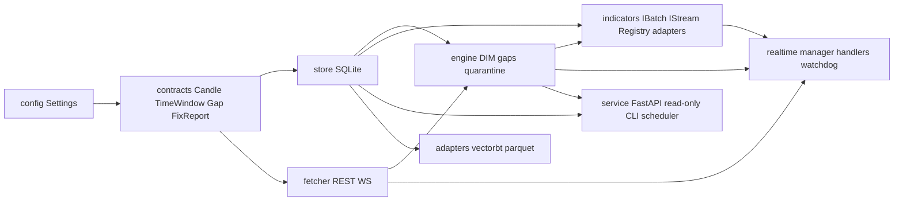
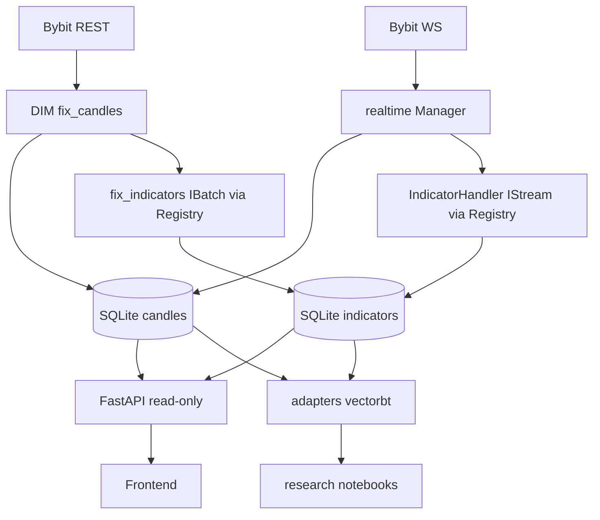

# Data Engine v2 — Master Plan

> Стратегическая карта проекта. Документ стабильный, меняется только при пересмотре общего направления — не при работе над конкретной фазой.

---

## Как читать этот документ

Документ разбит на три части:

- **Часть A — для владельца проекта.** Цель, что строим / не строим, что получишь к концу каждой фазы простыми словами, MVP. Без технических терминов.
- **Часть B — архитектурные решения.** Принципы, DECIDED / OPEN / DEFERRED, roadmap фаз в формате phase cards. Здесь живёт «куда мы идём и почему».
- **Часть C — техническая часть для Cursor.** Блок-схема зависимостей, правила перехода между фазами, структура документации.

Уровни документации в проекте:
- `00_master_plan.md` — этот файл, стабильный.
- `docs/phases/0N_*.md` — детальное ТЗ только для **ближайшей** фазы. Остальные фазы — короткие phase cards.
- `docs/adr/ADR-NNN-*.md` — спорные технические решения. ADR пишется **перед** нужной фазой, не «когда-нибудь».

---

# Часть A — для владельца проекта

## A1. Цель проекта (человеческим языком)

Программа-«движок данных», которая сама грузит свечи Bybit, проверяет, что в данных нет дыр, чинит их, считает технические индикаторы (EMA, RSI, ATR…) и отдаёт всё это для бэктестов в `vectorbt` и для realtime-стратегий.

**Зачем:** чтобы любая торговая логика, которую мы будем писать сверху, всегда работала на свежих и проверенных данных, без неожиданных «дыр» и без ручной возни.

## A2. Что строим / что не строим

**Строим:**
- слой данных (свечи + индикаторы) с гарантированным контрактом «нет дыр, нет magic-значений»;
- backfill истории и realtime-обновление;
- read-only HTTP-API и CLI для управляющих действий;
- research-интеграция с `vectorbt`: сначала простой скрипт в `research/`, полноценный adapter — позже, если появится повторяемая потребность.

**Не строим в этом проекте:**
- торговую логику, риск-менеджмент, ордер-роутинг — это потом, поверх этого слоя;
- веб-интерфейс / визуализацию — пока только CLI и HTTP-API; фронт строится позже отдельным проектом;
- мульти-биржу — пока только Bybit, но интерфейсы заложены под будущую подмену.

## A3. Что получишь к концу каждой фазы — простыми словами

- **Phase 1 — Foundation.** Пустой проект уже запускается одной командой и показывает состояние своей БД.
- **Phase 2 — Historical Backfill.** Одна команда грузит всю историю Bybit для одной пары и одного таймфрейма.
- **Phase 3 — DIM Repair.** Одна команда чинит любые дыры в данных до состояния «всё на месте».
- **Phase 4 — Simple Research Smoke.** На этих данных работает первый бэктест в `vectorbt`. **Это конец MVP.**
- **Phase 5 — Indicator Framework.** В системе появляются «настоящие» индикаторы: EMA/RSI/ATR/MACD/Bollinger живут в БД с явным статусом готовности, считаются единым контрактом, без локальных формул в research-скриптах.
- **Phase 6 — Realtime.** Движок работает в realtime: новые свечи и индикаторы обновляются сами, обрыв сети ничего не теряет.
- **Phase 7 — API & Multi-Symbol.** Несколько пар одновременно, есть HTTP-API на чтение, ежедневная авто-проверка вчерашних суток.
- **Phase 8 — Exports & Polish.** Добавлены Parquet-снимки для тяжёлых research-задач; проверено сутками непрерывной работы.

## A4. MVP Data Engine

**MVP = Phase 1 + Phase 2 + Phase 3 + Phase 4.**

Первая большая победа проекта:
- запустили новый проект (Phase 1);
- загрузили `BTCUSDT 1h` всю историю (Phase 2);
- проверили и починили дыры (Phase 3);
- запустили первый бэктест на чистых свечах (Phase 4).

MVP acceptance — `BTCUSDT 1h`. После MVP, но до multi-symbol rollout, прогоняем дополнительные smoke checks на `BTCUSDT 5m` и `BTCUSDT 1d`. `BTCUSDT 1m` отложен до явного отдельного решения.

**До MVP запрещено:**
- realtime / WebSocket;
- scheduler (apscheduler);
- multi-symbol rollout;
- Parquet export;
- FastAPI service;
- сложный indicator framework — индикаторы в Phase 4 живут одной строчкой `pd.ewm` внутри research-скрипта;
- production polish (CI, mypy-perfect, 7-дневный run).

Зачем такое жёсткое ограничение: чтобы в фундамент Phase 1–3 случайно не вшилась конкретная библиотека индикаторов / WebSocket-клиент / схема Parquet, которую потом пришлось бы выдирать.

## A5. Стэк по фазам (а не «всё сразу»)

| Когда добавляется | Что добавляется |
|---|---|
| **Phase 1 core** | Python 3.11+, SQLite (WAL), Typer CLI, `pydantic`/`pydantic-settings`, `pytest` |
| **Phase 2 backfill** | `pybit`, `tenacity` |
| **Phase 4 research** | `pandas`, `numpy`, `vectorbt` — как research-extras, не как core dependencies |
| **Indicators (Phase 5)** | выбранный indicator backend (решается ADR-001) + всегда `pandas_baseline` как reference |
| **Realtime (Phase 6)** | WebSocket-клиент Bybit (через `pybit` или аналог) |
| **Service (Phase 7)** | `FastAPI` (read-only), `apscheduler` |
| **Export (Phase 8)** | `pyarrow` / Parquet |

Правило: **никакая зависимость не появляется в `pyproject.toml` раньше своей фазы**, даже «на всякий случай». Это часть acceptance каждой фазы.

---

# Часть B — архитектурные решения

## B1. Ключевые принципы (короткая аксиоматика)

- **Один источник правды на конфиг.** Все модули принимают зависимости через конструктор/функцию, а не читают конфиг глобально.
- **Один путь к БД.** `Settings.db_path`. Всё остальное — ошибка интеграции.
- **Один алгоритм поиска дыр.** Появится в Phase 3 как единственная реализация, переиспользуется в DIM и в watchdog realtime.
- **Одно временное представление.** `open_time_ms` (см. DECIDED).
- **Одно направление зависимостей слоёв** (см. блок-схему в части C). Никаких импортов снизу вверх.
- **DIM не звонит сам себе.** `fix_candles` и `fix_indicators` строго двухфазны (preflight → fix → postflight), без рекурсии.
- **Запись в БД — только через `engine` (DIM) и `realtime` (handlers).** API — read-only.
- **Indicator backend изолирован в адаптерах.** Никто вне `data_engine/indicators/adapters/` не импортирует конкретные indicator-библиотеки. Контракт — только интерфейсы и реестр.
- **Одна фаза = одна рабочая вертикаль = git tag «работает end-to-end».** Между фазами можно остановиться без обещаний «когда-нибудь свяжем».

## B2. Принятые решения (DECIDED)

> Эти решения уже встроены в архитектурный фундамент и в Phase 1. Менять — только через явный пересмотр мастер-плана.

- **SQLite + WAL** как основное хранилище (`journal_mode=WAL`, `busy_timeout=30000`, `synchronous=NORMAL`).
- **`open_time_ms` (INTEGER, миллисекунды UTC)** — единственная временная колонка во всей системе. Имя `open_time_ms`, не `timestamp`. Bybit отдаёт миллисекунды; конверсия в секунды — лишний шаг и шанс на off-by-one. В будущем (тики) секунд недостаточно — менять схему позже = миграция большой БД.
- **Свечи и индикаторы хранятся в разных таблицах.** Точная схема `indicators` остаётся открытой (ADR-002), но **факт раздельного хранения** — зафиксирован.
- **CLI — единственный путь для управляющих действий.** `backfill`, `fix`, `run` — это команды Typer-CLI, а не HTTP-эндпоинты.
- **FastAPI — строго read-only.** Mutating endpoints запрещены архитектурно. `POST/PUT/DELETE/PATCH` → 405. Ручная починка — `engine fix` в CLI; регулярная — apscheduler.
- **Indicator-слой = интерфейсы + реестр + адаптеры.** Конкретный backend выбирается ADR-001 в Phase 5, не на старте.
- **Batch и Stream — два разных интерфейса.** Эквивалентность после warmup обязательна и покрывается тестом.
- **Один фетчер = один протокол.** `IFetcher` Protocol; конкретные реализации (`BybitREST`, `BybitWS`) — за интерфейсом.

## B3. Открытые решения (OPEN)

> Будут закрыты spike-исследованием или ADR **перед** нужной фазой. Сейчас фиксируем как направление и ограничения, не как реализацию.

| ID | Тема | Когда решаем |
|----|------|--------------|
| ADR-001 | Конкретная библиотека индикаторов (`pandas-ta` / `ta-numba` / `streaming-indicators` / `TA-Lib` + `pandas_baseline` всегда). | Перед Phase 5 |
| ADR-002 | Точная схема таблицы `indicators` (multi-parameter / multi-output, статус-модель, политика warmup). | Перед Phase 5 |
| ADR-003 | Realtime indicator state: хранить сериализуемый `state` или восстанавливать seed из истории. | Перед Phase 6 |
| ADR-004 | Parquet export/read model: партиционирование, частота снимков, контракт с `vbt.ParquetData`. | Перед Phase 8 |

## B4. Отложенные решения (DEFERRED)

> Не делаем до отдельного сигнала боли. Только направление, никаких файлов и тестов до фазы.

- **Parquet export** — только в Phase 8, и только если research реально упирается в скорость SQLite.
- **Multi-symbol rollout** — Phase 7 (≥3 пары одновременно). Ранние фазы пишут generic-кодом, но запускаются на одной паре.
- **Scheduler (apscheduler daily integrity)** — Phase 7. До этого — только ручной `engine fix`.
- **Полноценный `vectorbt`-адаптер в core** — до Phase 5/8 в `research/` лежит обычный скрипт.
- **Production CI / 7-дневный stability run** — Phase 8.
- **Веб-фронт** — не в этом проекте.
- **Мульти-биржа** — только Bybit; интерфейс `IFetcher` оставляет дверь открытой.

## B5. Roadmap фаз (phase cards)

> Подробное ТЗ — только для ближайшей фазы (`docs/phases/01_foundation.md`).
> Остальные фазы — короткие **phase cards**: цель, прикладной результат, зависимости, открытые вопросы, явные «не делать раньше». Это ориентир, чтобы Phase 1–3 не построились так, что потом realtime/API/индикаторы окажутся невозможными.
>
> Уровень детализации по горизонту:
> - Phase 1 — детальное ТЗ.
> - Phase 2–4 — phase cards с ключевыми модулями и общим acceptance.
> - Phase 5–8 — phase cards с прикладным результатом, зависимостями, открытыми вопросами, явными ограничениями. Без списков файлов и имён тестов.

### Phase 1 — Foundation
- **Цель.** Новый проект запускается с нуля, создаёт правильную SQLite-БД и умеет показать её состояние одной командой `python -m data_engine status`.
- **Прикладной результат.** «Hello, world» для всей системы: видно, что окружение настроено правильно и фундамент стоит.
- **Зависимости.** Никаких; первая фаза.
- **Что точно не делать в Phase 1.** Fetcher, DIM, indicators (даже интерфейсы), realtime, FastAPI, vectorbt-адаптер, Parquet, apscheduler, отдельные `CandleStore/MetaStore/QuarantineStore`-классы.
- **Подробное ТЗ.** `docs/phases/01_foundation.md`.

### Phase 2 — Historical Backfill
- **Цель.** `python -m data_engine backfill --symbol BTCUSDT --tf 1h` загружает всю историю от реального `launchTime` Bybit; повторный запуск идемпотентен.
- **Прикладной результат.** Одна команда — вся история одной пары/TF в БД, без ручной работы.
- **Зависимости.** Phase 1.
- **Что появляется (общими словами).** `IFetcher` Protocol; REST-имплементация с чанкингом и ретраями; resolver `launchTime`; `time_grid` (`align_to_grid`, `tf_ms`). Контракт `Store`-а расширяется парой методов: `upsert(rows)` и `range_get(symbol, tf, window)` — оба нужны уже здесь (upsert для backfill, range_get для self-проверки и для будущего research; делать `range_get` отдельной фазой не имеет смысла).
- **Что не делать раньше.** DIM, gap-fill, indicators, WS, FastAPI, scheduler.

### Phase 3 — DIM Repair
- **Цель.** `python -m data_engine fix --symbol BTCUSDT --tf 1h` приводит БД к контракту «дыр нет, OHLC валиден, свежесть в норме», даже если внутри есть дыры или БД пустая.
- **Прикладной результат.** Авто-«ремонтник» данных. Magic-значения `-1` в БД больше не появляются.
- **Зависимости.** Phase 2.
- **Что появляется (общими словами).** Единственный алгоритм поиска дыр; quarantine-флоу; двухфазный `fix_candles` (preflight → fix → postflight) с OHLC-валидацией и freshness check.
- **Что не делать раньше.** Indicators, realtime, scheduler, FastAPI.

### Phase 4 — Simple Research Smoke (финал MVP)
- **Цель.** На очищенных свечах работает первый бэктест в `vectorbt`. Данные доезжают до стратегии без NaN.
- **Прикладной результат.** Первая «большая победа» проекта: загрузили историю → починили дыры → прогнали бэктест.
- **Зависимости.** Phase 3 (чистая БД свечей).
- **Что появляется (общими словами).** Только `research/ema_smoke.py` — самостоятельный скрипт, который читает свечи через тот же `range_get`, считает EMA(20)/EMA(50) одной строчкой `pd.ewm(adjust=False)` локально, собирает `vbt.Data`, печатает Sharpe/PF.
- **Что не делать раньше.** Полноценный indicator framework (`IIndicatorBatch`, registry, adapters/), запись индикаторов в SQLite, ADR-001 spike. Индикаторный слой — это Phase 5; в Phase 4 EMA считается одной строчкой `pd.ewm` прямо в research-скрипте, потому что цель фазы — «свечи доезжают до vbt», а не «архитектура индикаторов».

### Phase 5 — Indicator Framework
- **Цель.** После MVP проект перестаёт считать индикаторы локально в research-скриптах. Появляется индикаторный слой как часть core: единый контракт, единая точка регистрации, явный статус готовности значения.
- **Прикладной результат.** Research, бэктест и (позже) realtime используют один и тот же источник индикаторов из БД, с понятной семантикой «это значение можно использовать в стратегии».
- **Зависимости.** Закрытый MVP (Phase 4).
- **Decision gates.** ADR-001 (выбор библиотеки индикаторов), ADR-002 (схема таблицы `indicators`).
- **Что не делать раньше.** В Phase 1–4 не появляются: модуль `data_engine/indicators/`, таблица `indicators` в БД, зависимости под конкретные indicator-библиотеки. Никаких ema-specific хардкодов в DIM или research.
- **Ключевые открытые вопросы.** Какую библиотеку выбрать; как хранить multi-parameter и multi-output индикаторы; как формализовать warmup и готовность значений. Конкретные имена файлов, формулы warmup, тестовые tolerance — это уровень детального ТЗ Phase 5, не мастер-плана.

### Phase 6 — Realtime
- **Цель.** Движок работает в realtime: новые свечи и индикаторы обновляются сами; обрыв сети ничего не теряет.
- **Прикладной результат.** Процесс можно оставить запущенным, не заглядывать в БД и быть уверенным, что данные не разъезжаются.
- **Зависимости.** Phase 5.
- **Decision gates.** ADR-003 (realtime indicator state).
- **Что не делать раньше.** Никакого `realtime/`, никакого WS-клиента, никакого CLI `run` до Phase 6. Multi-symbol параллелизм — Phase 7.
- **Ключевые открытые вопросы.** Как seed-ить indicator-стрим при старте; как catch-up-ить пропущенные свечи при долгом обрыве WS; нужно ли хранить state стрима между запусками. Конкретные пороги latency, watchdog-интервалы, формулы seed — это уровень детального ТЗ Phase 6, не мастер-плана.

### Phase 7 — API & Multi-Symbol
- **Цель.** HTTP-API на чтение, авто-проверка вчерашних суток ежедневно, несколько пар одновременно в realtime.
- **Прикладной результат.** Фронт/research/curl читают данные по документированному контракту; оператор не дёргает БД руками каждое утро; одна машина обслуживает несколько пар.
- **Зависимости.** Phase 6.
- **Decision gates.** Нет жёстких ADR; конкретный JSON-контракт API фиксируется детальным ТЗ перед стартом фазы.
- **Что не делать раньше.** FastAPI, apscheduler, multi-symbol manager — всё только после Phase 6.
- **Ключевые открытые вопросы.** Точный JSON-контракт; нужна ли минимальная авторизация; стоит ли дробить фазу на несколько шагов (детали и точная декомпозиция — в `docs/phases/07_api.md`).

### Phase 8 — Exports & Polish
- **Цель.** Снимки данных для тяжёлой research-работы вне SQLite + production polish.
- **Прикладной результат.** Финиш слоя данных: можно строить торговые стратегии, не оглядываясь на надёжность данных.
- **Зависимости.** Phase 7.
- **Decision gates.** ADR-004 (Parquet export/read model).
- **Что не делать раньше.** `pyarrow`/Parquet, CI-pipeline, production-полировки — всё после Phase 7.
- **Ключевые открытые вопросы.** Структура дерева экспорта и его связь с `vectorbt`/`vectorbt-pro`; частота снимков; как работать с warmup/error-рядами индикаторов в Parquet. Конкретные пути, компрессия, длительность stability-run-а — уровень детального ТЗ Phase 8.

---

# Часть C — техническая часть для Cursor

## C1. Блок-схема системы (направление зависимостей)



Запрещённые рёбра: `store -> fetcher`, `engine -> service`, `realtime -> service`, любые круговые импорты между слоями.

Поток данных в проде (актуально с Phase 6):



> Это **картина системы целиком**. В каждой конкретной фазе существуют только те узлы, которые уже введены — не «все сразу».

## C2. Правила перехода между фазами

Между фазами — git tag `phase-N-done`. Перейти к фазе N+1 разрешается, только если:

1. **Acceptance-критерии фазы N выполнены и автоматизированы** — либо чек в pytest/CI, либо документированный manual smoke с записанным результатом.
2. **Нет артефактов «временно положил руками»** — миграционные хаки, hard-coded пути, закомментированные тесты, TODO без owner-а.
3. **Diff фазы читается за один присест.** Если PR > 800 строк нового кода — фаза слишком крупная, разбиваем (см. право дробления Phase 7).
4. **Decision gate закрыт.** Если у фазы есть ADR-зависимость (ADR-001/002 для Phase 5, ADR-003 для Phase 6, ADR-004 для Phase 8), ADR должен быть написан и принят **до** старта реализации фазы.
5. **Никаких импортов из будущих фаз.** Фаза N не должна импортировать модули из слоёв, которые ещё не существуют, и не должна «на всякий случай» добавлять заглушки.
6. **Никаких лишних зависимостей в `pyproject.toml`.** Каждая фаза добавляет ровно те, что заявлены в A5.

Это и есть защита от расползания: на каждом тэге система запускается на чистой машине и делает одно конкретное полезное действие.

## C3. Документы и где они живут

```
docs/
  00_master_plan.md                         # этот файл; стабильный
  phases/
    01_foundation.md                        # детальное ТЗ — текущая фаза
    02_historical_backfill.md               # phase card / заглушка
    03_dim_repair.md                        # phase card / заглушка
    04_research_smoke.md                    # phase card / заглушка
    05_indicators.md                        # phase card / заглушка + ADR-001/002 gate
    06_realtime.md                          # phase card / заглушка + ADR-003 gate
    07_api.md                               # phase card / заглушка (с правом дробления 7A/7B/7C)
    08_exports_polish.md                    # phase card / заглушка + ADR-004 gate
  adr/
    ADR-001-indicator-backend.md            # OPEN
    ADR-002-indicator-storage-shape.md      # OPEN
    ADR-003-realtime-indicator-state.md     # OPEN
    ADR-004-parquet-export-model.md         # OPEN
```

Правило обновления:
- `00_master_plan.md` — стабилен. Меняется при пересмотре направления, не при работе над фазой.
- `docs/phases/0N_*.md` — заглушка превращается в детальное ТЗ **только когда стартует фаза N**, и не раньше.
- `docs/adr/ADR-NNN-*.md` — пишется перед стартом фазы, у которой стоит соответствующий decision gate. Не раньше.
