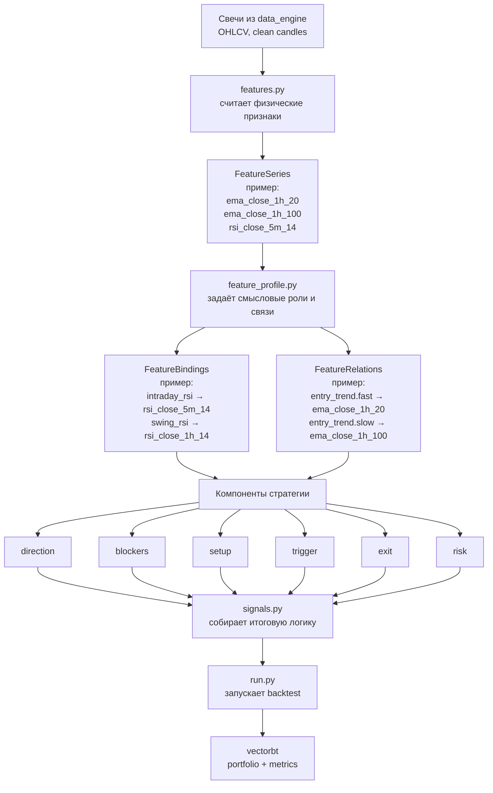

# Целевая схема FeaturesDev (человеческое объяснение)

Ниже — целевая схема того, как должен идти поток данных и смыслов внутри research-слоя.



## Как это читать по-человечески

1. `data_engine` даёт нам **чистые свечи**.
2. `features.py` из свечей считает **физические признаки**:
   - EMA,
   - RSI,
   - ATR,
   - другие числовые series.
3. `feature_profile.py` говорит, **как эти признаки понимать по смыслу**:
   - какой RSI считать `intraday_rsi`,
   - какой RSI считать `swing_rsi`,
   - какие EMA образуют relation `entry_trend`.
4. Компоненты стратегии (`direction`, `setup`, `trigger` и т.д.) **не считают индикаторы сами**, а используют уже готовые смысловые роли и relations.
5. `signals.py` соединяет ответы компонентов в итоговый вход/выход.
6. `run.py` запускает backtest.
7. `vectorbt` считает результат.

## Простой пример

Допустим, у нас есть физические признаки:

- `ema_close_1h_20`
- `ema_close_1h_100`
- `rsi_close_5m_14`
- `rsi_close_1h_14`
- `rsi_close_1d_14`

Тогда в `feature_profile.py` мы можем сказать:

- `intraday_rsi = rsi_close_5m_14`
- `swing_rsi = rsi_close_1h_14`
- `daily_rsi = rsi_close_1d_14`

И relation:

- `entry_trend.fast = ema_close_1h_20`
- `entry_trend.slow = ema_close_1h_100`

После этого компоненту не нужно знать физические названия колонок.  
Он говорит просто:

- «дай мне `swing_rsi`»
- «дай мне `entry_trend.fast`»
- «дай мне `entry_trend.slow`»

А `FeaturesDev` уже знает, какие реальные series стоят за этими ролями.

## Зачем это нужно

Чтобы не было хаоса вида:

- `setup.py` сам считает EMA,
- `trigger.py` сам считает RSI,
- `blockers.py` сам лезет в старший таймфрейм,
- и потом невозможно понять, что именно тестировалось.

Здесь же логика разделена:

- `features.py` — считает;
- `feature_profile.py` — задаёт смысл;
- компоненты — используют смысл;
- `signals.py` — собирает;
- `run.py` — запускает.

---

# Research Stage 5 — FeaturesDev Layer

## Goal

Stage 5 вводит отдельный слой подготовки признаков перед Component Registry.

Цель этапа — не придумать торговую стратегию и не построить feature-framework, а зафиксировать правильную границу ответственности:

```text
features.py считает признаки рынка.
feature_profile.py задаёт смысловые роли и relations этих признаков.
components используют подготовленные признаки через semantic bindings/relations.
signals.py соединяет outputs компонентов.
run.py запускает experiment.
```

Главный принцип:

```text
Компоненты не считают EMA, RSI, ATR, trend/context и другие индикаторы внутри себя.
```

---

## Core idea

Вводятся четыре понятия.

### FeatureSeries

`FeatureSeries` — физически подготовленная серия.

Примеры:

```text
ema_close_1h_20
ema_close_1h_100
ema_close_1d_20
ema_close_1d_200
rsi_close_5m_14
rsi_close_1h_14
rsi_close_1d_14
```

FeatureSeries описывает, **что именно посчитано**:

```text
indicator type
timeframe
source
period/params
```

FeatureSeries сама по себе не является `fast`, `slow`, `intraday`, `swing` или `daily`.

---

### FeatureBinding

`FeatureBinding` — смысловая роль одной FeatureSeries внутри strategy family.

Пример для RSI:

```text
intraday_rsi -> rsi_close_5m_14
swing_rsi    -> rsi_close_1h_14
daily_rsi    -> rsi_close_1d_14
```

Компонент не должен обращаться напрямую к `rsi_close_1h_14`.

Компонент должен обращаться к смысловой роли:

```text
swing_rsi
```

А какой физический RSI стоит под этой ролью, решает FeatureProfile.

---

### FeatureRelation

`FeatureRelation` — смысловая связь нескольких FeatureSeries.

Пример для EMA trend relation:

```text
entry_trend:
  fast = ema_close_1h_20
  slow = ema_close_1h_100

macro_trend:
  fast = ema_close_1d_20
  slow = ema_close_1d_200
```

`fast` / `slow` — это роли внутри relation, а не свойства самой EMA.

Одна и та же EMA может быть `slow` в одной relation и `fast` в другой:

```text
daily_fast_trend:
  fast = ema_close_1d_10
  slow = ema_close_1d_20

daily_macro_trend:
  fast = ema_close_1d_20
  slow = ema_close_1d_200
```

---

### FeatureProfile

`FeatureProfile` — полный набор FeatureSeries + FeatureBindings + FeatureRelations для конкретного research experiment.

FeatureProfile — это не вечная настройка стратегии. Это одно из измерений эксперимента.

Сегодня profile задаётся руками. Позже grid сможет программно перебирать разные profiles.

Пример:

```text
feature_profile = ema_pullback_default

series:
  ema_close_1h_20
  ema_close_1h_100
  rsi_close_5m_14
  rsi_close_1h_14
  rsi_close_1d_14

bindings:
  intraday_rsi = rsi_close_5m_14
  swing_rsi    = rsi_close_1h_14
  daily_rsi    = rsi_close_1d_14

relations:
  entry_trend:
    fast = ema_close_1h_20
    slow = ema_close_1h_100
```

---

## Why this is needed

Без FeaturesDev компоненты быстро начнут сами считать индикаторы:

```text
setup.py считает EMA
trigger.py считает RSI
blockers.py сам лезет в старший TF
exits.py считает ATR
```

Это приведёт к дублированию, скрытым расхождениям и невозможности понять, какая стратегия реально тестировалась.

FeaturesDev нужен, чтобы:

```text
1. централизовать расчёт признаков;
2. отделить физические series от смысловых ролей;
3. дать компонентам стабильный язык доступа к признакам;
4. подготовить основу для будущего component grid и batch backtests.
```

---

## Where semantics live

Семантика не живёт в `data_engine/`.

Семантика не живёт внутри компонентов.

Семантика живёт внутри research strategy family.

Для `ema_pullback` минимальная структура Stage 5:

```text
research/strategies/ema_pullback/
  features.py
  feature_profile.py
```

Ответственность:

```text
features.py
  считает физические FeatureSeries

feature_profile.py
  описывает FeatureProfile:
    series
    bindings
    relations
```

---

## StrategyConfig impact

`StrategyConfig` должен получить поле:

```text
feature_profile
```

На первом этапе:

```text
feature_profile = "ema_pullback_default"
```

`feature_profile` должен входить в deterministic `config_id`.

Причина: две стратегии с одинаковыми component ids, но разными feature profiles — это разные strategy instances.

`db_path` по-прежнему не входит в `config_id`.

---

## Grid compatibility

Stage 5 не делает grid.

Но Stage 5 должен сделать будущий grid возможным.

Правильная будущая модель:

```text
Grid создаёт много StrategyConfig.
StrategyConfig выбирает feature_profile.
FeatureProfile задаёт semantic bindings/relations.
Components используют semantic roles.
```

Пример будущего перебора:

```text
profile_001:
  intraday_rsi = rsi_close_5m_14
  swing_rsi    = rsi_close_1h_14
  daily_rsi    = rsi_close_1d_14

profile_002:
  intraday_rsi = rsi_close_15m_14
  swing_rsi    = rsi_close_1h_14
  daily_rsi    = rsi_close_1d_14

profile_003:
  intraday_rsi = rsi_close_5m_14
  swing_rsi    = rsi_close_4h_14
  daily_rsi    = rsi_close_1d_14
```

Компоненты при этом не меняются. Они всё равно обращаются к:

```text
intraday_rsi
swing_rsi
daily_rsi
entry_trend.fast
entry_trend.slow
```

---

## Minimal Stage 5 scope

Stage 5 должен быть минимальным.

Реализуем только основу:

```text
feature_profile.py
  FeatureSeries
  FeatureBinding
  FeatureRelation
  FeatureProfile
  default profile for ema_pullback

features.py
  продолжает готовить текущие EMA-признаки
  но теперь они считаются частью default FeatureProfile
```

Для текущего `ema_pullback` минимальный default profile может описывать текущую EMA-пару как relation:

```text
feature_profile = ema_pullback_default

relations:
  entry_trend:
    fast = ema_fast
    slow = ema_slow
```

`ema_fast` / `ema_slow` могут остаться compatibility columns на первом внедрении, но архитектурно они должны трактоваться как роли relation `entry_trend`, а не как универсальные EMA-сущности.

---

## Out of scope

Stage 5 не делает:

```text
RSI implementation
ATR implementation
multi-timeframe engine
higher-timeframe alignment
global trend
oversold/overbought logic
feature cache
parquet export
feature store
global feature framework
component registry changes beyond what is needed for compatibility
component grid
optimizer
frontend/visual constructor
live trading/execution/order routing
backend indicators
data_engine changes
writes to operational SQLite
```

---

## Rollout steps

### Step 5.1 — Document the model

Зафиксировать в документе Stage 5:

```text
FeatureSeries
FeatureBinding
FeatureRelation
FeatureProfile
```

---

### Step 5.2 — Add family-local feature profile

Создать:

```text
research/strategies/ema_pullback/feature_profile.py
```

В нём описать default profile:

```text
ema_pullback_default
```

---

### Step 5.3 — Keep current EMA features compatible

Не ломать текущие `ema_fast` / `ema_slow`.

На первом внедрении они могут остаться physical columns, но должны быть представлены как relation:

```text
entry_trend.fast = ema_fast
entry_trend.slow = ema_slow
```

---

### Step 5.4 — Add feature_profile to StrategyConfig

Добавить в `StrategyConfig` поле:

```text
feature_profile = "ema_pullback_default"
```

Добавить `feature_profile` в `config_id`.

Проверить, что `db_path` по-прежнему не влияет на `config_id`.

---

### Step 5.5 — Add tests

Проверить:

```text
default feature profile exists
default feature profile has entry_trend relation
entry_trend has fast and slow roles
feature_profile is included in config_id
changing feature_profile changes config_id
changing db_path does not change config_id
existing manual variants still work
```

---

### Step 5.6 — Run acceptance commands

```bash
python -m pytest -q
python research/strategies/ema_pullback/run.py
python research/ema_smoke.py
git diff --stat data_engine/
git status -sb
```

---

### Step 5.7 — Add implementation summary

После реализации добавить короткий summary в этот документ:

```text
что добавлено
какие файлы изменены
что осталось совместимым
какие проверки выполнены
подтверждение, что data_engine/ не изменялся
```

---

## Acceptance result

Stage 5 считается успешным, если:

```text
1. Есть family-local feature_profile.py.
2. Default FeatureProfile описывает текущую EMA relation.
3. StrategyConfig выбирает feature_profile.
4. feature_profile входит в config_id.
5. Текущие manual variants продолжают работать.
6. run.py печатает comparison table и status=ok.
7. research/ema_smoke.py остаётся рабочим.
8. Все тесты проходят.
9. data_engine/ не изменён.
```

---

## Architecture notes

FeaturesDev — это не торговая логика.

FeaturesDev — это слой подготовки языка признаков.

Торговая логика начинается позже, когда components начнут использовать semantic bindings/relations.

Главная граница:

```text
features/profile layer говорит: что известно о рынке и как это называется по смыслу.
components говорят: как использовать это знание для signal logic.
```
