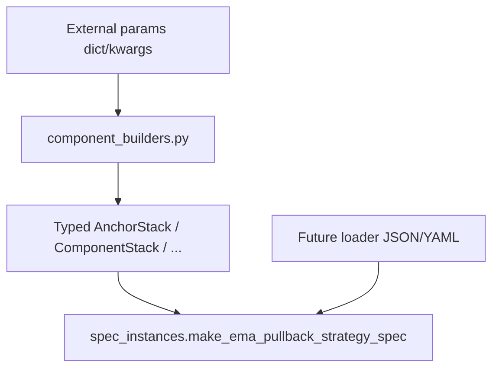

# Step 12: `component_builders.py` — typed spec assembly

## Цель

Единый **pure-builder** слой для `ema_pullback`: внешние параметры (kwargs / dict после parse+validate) → строго типизированные dataclass-ы из [`research/strategies/ema_pullback/spec.py`](../../research/strategies/ema_pullback/spec.py). Без расчёта индикаторов, без `DataFrame`, без `vectorbt`.

## Модуль [`component_builders.py`](../../research/strategies/ema_pullback/component_builders.py)

### EMA / anchor

- `ema(period: int, *, timeframe: str = "base", source: str = "close") -> EmaSpec`
- `anchor_stack(*, fast: EmaSpec, anchor: EmaSpec, slow: EmaSpec) -> AnchorStackSpec`
- `anchor_stack_from_periods(*, fast: int, anchor: int, slow: int, timeframe: str = "base", source: str = "close") -> AnchorStackSpec`

### RSI feature

- `rsi_feature(*, timeframe: str = "base", period: int = 14) -> RsiFeatureSpec`

### Trigger

- `trigger(component_id: str) -> TriggerSpec`
- `trigger_touch_anchor() -> TriggerSpec` — id из `components/registry.py` (`TOUCH_ANCHOR_COMPONENT`)
- `trigger_reclaim_anchor() -> TriggerSpec` — `RECLAIM_ANCHOR_COMPONENT`

Shortcuts не размазывают raw string literals по коду: строки берутся из констант registry.

### Direction / setup / risk (component id как `str`)

- **`direction_ema_anchor_stack() -> str`** — возвращает **`ema_anchor_stack_trend`** (`EMA_ANCHOR_STACK_TREND_COMPONENT` в registry). После Step 11 компонент direction **side-aware** (long: fast > anchor > slow; short: fast < anchor < slow); старый id `ema_anchor_stack_bullish` **не используется**, alias нет.
- `setup_untouched_anchor() -> str`
- `risk_no_filter() -> str`

### Blocker

- `blocker_rule(component_id: str, *, rsi=..., lookback=..., long_block_above=..., short_block_below=...) -> BlockerRuleSpec`
- `blocker_none()`, `blocker_counter_candle()`
- `blocker_extreme_rsi(*, timeframe=..., period=..., lookback=..., long_block_above=..., short_block_below=...) -> BlockerRuleSpec`

### Exit rules (`ExitRuleSpec`)

- `exit_rule(...)` — generic
- `exit_no_signal()` → `no_signal_exit`, `exit_kind="signal"`
- `exit_rsi(...)` → `rsi_signal_exit` + пороги / RSI feature
- `exit_atr_stop_loss(...)`, `exit_atr_take_profit(...)` — с `distance` через `atr_distance(...)` и корректным `exit_kind`
- **`exits_atr_default(*, atr_period, stop_atr_multiplier, take_atr_multiplier) -> tuple[ExitRuleSpec, ExitRuleSpec]`** — пара `atr_stop_loss` + `atr_take_profit` (как baseline в фабрике)

Согласованность `component_id` / `exit_kind` с `_EXIT_COMPONENT_KINDS` в `spec.py` — валидация в `__post_init__`.

### Остальное

- `atr_distance(*, timeframe: str = "base", period: int, multiplier: float) -> AtrDistanceSpec`
- `trade_sides(enabled: Sequence[TradeSide] = ("long",)) -> TradeSideSpec`
- `untouched_anchor_setup_spec(*, lookback: int = 50, active_bars: int = 3) -> UntouchedAnchorSetupSpec`
- **`component_stack(*, direction=None, blockers=None, setup=None, trigger=None, exits=None, risk=None) -> ComponentStackSpec`**

Дефолты при вызове `component_stack()` без аргументов (или с `None` на соответствующих полях):

- `direction` → `direction_ema_anchor_stack()` → **`ema_anchor_stack_trend`**
- `blockers` → `(blocker_none(),)`
- `setup` → `setup_untouched_anchor()`
- `trigger` → `trigger_reclaim_anchor()`
- `exits` → `exits_atr_default(atr_period=14, stop_atr_multiplier=1.5, take_atr_multiplier=4.0)` (совпадает с дефолтами `make_ema_pullback_strategy_spec`)
- `risk` → `risk_no_filter()`

**Trade management:** отдельного builder для `TradeManagementSpec` нет; на `EmaPullbackStrategySpec` остаётся `field(default_factory=TradeManagementSpec)` из `spec.py`.

### Нормализация и guardrails

- `Sequence -> tuple` для `trade_sides.enabled`, `components.blockers`, `components.exits` (через `_normalize_sequence`).
- **`str` / `bytes` не принимаются как Sequence** для этих полей (исключена посимвольная «упаковка» в tuple) — `TypeError`.

### Границы

- В **`component_builders.py` нет** builder полного `EmaPullbackStrategySpec` — только «кирпичи» и `component_stack`.
- Валидация бизнес-правил — в `spec.py` (`__post_init__`); builders: construction + нормализация входа.

## [`spec_instances.py`](../../research/strategies/ema_pullback/spec_instances.py)

Публичные фабрики: `make_ema_pullback_strategy_spec`, `default_ema_pullback_strategy_spec`, `active_strategy_specs`, `variant_from_spec` — без изменения смысла для существующих вызовов.

### `make_ema_pullback_strategy_spec`

Ключевые параметры (помимо anchor periods, symbol, timeframe, setup lookback, ATR):

- **`enabled_sides: Sequence[TradeSide] = ("long",)`** — допускается list/tuple и др. sequence; внутри **`trade_sides(enabled_sides)`** → tuple в `TradeSideSpec`.
- **`components: ComponentStackSpec | None = None`**
  - **`None`** — baseline: тот же набор, что даёт явный вызов `component_stack(...)` с `exits_atr_default(atr_period=..., stop_atr_multiplier=..., take_atr_multiplier=...)` из числовых параметров фабрики.
  - **переданный `ComponentStackSpec`** — **source of truth**: фабрика **не перезаписывает** trigger/blockers/exits и т.д.; параметры `atr_period` / multipliers **не подмешиваются** в exits, если задан свой stack.

`variant` по-прежнему из периодов anchor stack; `trade_management` не собирается явно (дефолт dataclass).

## Поток сборки

## Тесты (актуальные зоны)

- [`tests/test_ema_pullback_manual_variants.py`](../../tests/test_ema_pullback_manual_variants.py) — baseline direction **`ema_anchor_stack_trend`**, anchor/exits equivalence, **custom `components`**, **различие `strategy_spec_config_id`** baseline vs custom.
- [`tests/test_strategy_config_instance.py`](../../tests/test_strategy_config_instance.py) — builders shortcuts, **`enabled_sides` как list**, guardrail `str/bytes` для sequences.
- [`tests/test_ema_pullback_exits.py`](../../tests/test_ema_pullback_exits.py), [`tests/test_ema_pullback_feature_profile.py`](../../tests/test_ema_pullback_feature_profile.py) — согласованность с дефолтным spec.

## Критерии (выполнено)

- Нет ручной глубокой вложенной сборки anchor / пары ATR exits / baseline `component_stack` в `spec_instances` — через builders.
- Нет второго пути «full spec builder» в `component_builders.py`.
- Дефолт `component_stack()` совпадает с baseline exits **14 / 1.5 / 4.0**; нет builder для `TradeManagementSpec`.
- Direction registry: **`ema_anchor_stack_trend`**; **`ema_anchor_stack_bullish` удалён**, alias отсутствует.
- Фабрика: **`components` опционален**; **`enabled_sides: Sequence[TradeSide]`**.

Подробности для пользователей пайплайна см. также [`research/strategies/ema_pullback/README.md`](../../research/strategies/ema_pullback/README.md).
