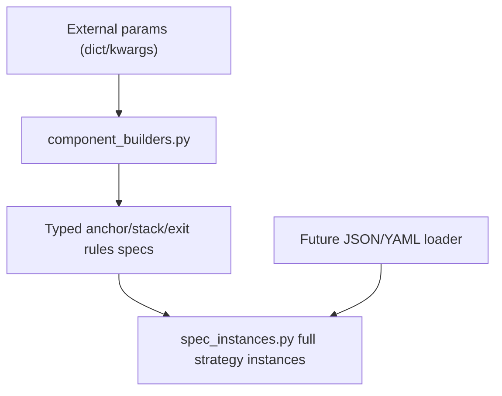

# Step 12: `component_builders.py` for typed spec assembly

## Цель
Сделать единый pure-builder слой для `ema_pullback`, который принимает внешние параметры (kwargs/dict-loader input) и возвращает строго типизированные объекты из [`D:/_bbb_new_gen/research/strategies/ema_pullback/spec.py`](D:/_bbb_new_gen/research/strategies/ema_pullback/spec.py), без расчётов данных, `df` и `vectorbt`.

## Что реализуем

### 1) Новый модуль builders
Создать [`D:/_bbb_new_gen/research/strategies/ema_pullback/component_builders.py`](D:/_bbb_new_gen/research/strategies/ema_pullback/component_builders.py) с функциями по ролям:

- EMA / anchor:
  - `ema(period: int, *, timeframe: str = "base", source: str = "close") -> EmaSpec`
  - `anchor_stack(*, fast: EmaSpec, anchor: EmaSpec, slow: EmaSpec) -> AnchorStackSpec`
  - `anchor_stack_from_periods(*, fast: int, anchor: int, slow: int, timeframe: str = "base", source: str = "close") -> AnchorStackSpec`
- RSI feature:
  - `rsi_feature(*, timeframe: str = "base", period: int = 14) -> RsiFeatureSpec`
- Trigger:
  - `trigger(component_id: str) -> TriggerSpec`
  - shortcut `trigger_touch_anchor() -> TriggerSpec`
  - shortcut `trigger_reclaim_anchor() -> TriggerSpec`
  - shortcut-функции используют family-local constants (не raw string literals по коду)
- Direction component id:
  - `direction_ema_anchor_stack() -> str`
- Setup component id:
  - `setup_pullback_to_anchor() -> str`
- Blocker:
  - generic `blocker_rule(...) -> BlockerRuleSpec`
  - `blocker_none() -> BlockerRuleSpec`
  - `blocker_counter_candle() -> BlockerRuleSpec`
  - shortcut `blocker_extreme_rsi(...) -> BlockerRuleSpec`
- **Exit rules** (единый тип для signal / SL / TP по дистанции):
  - generic `exit_rule(...) -> ExitRuleSpec`
  - `exit_no_signal() -> ExitRuleSpec` → `no_signal_exit`, `exit_kind="signal"`
  - `exit_rsi(...) -> ExitRuleSpec` → `rsi_signal_exit` + пороги/RSI feature
  - `exit_atr_stop_loss(...) -> ExitRuleSpec` / `exit_atr_take_profit(...) -> ExitRuleSpec` с `distance=AtrDistanceSpec(...)` и корректным `exit_kind`
  - shortcut **`exits_atr_default(*, atr_period, stop_atr_multiplier, take_atr_multiplier) -> tuple[ExitRuleSpec, ExitRuleSpec]`** — пара `atr_stop_loss` + `atr_take_profit`, как в текущем `make_ema_pullback_strategy_spec`
  - маппинг на `_EXIT_COMPONENT_KINDS` в `spec.py`: несовпадение `component_id` / `exit_kind` ловит `__post_init__`
- Risk component id:
  - `risk_no_filter() -> str`
- **Trade management:** отдельный builder для `TradeManagementSpec` **не** вводим; на `EmaPullbackStrategySpec` остаётся дефолт `field(default_factory=TradeManagementSpec)` из `spec.py`. **Не** восстанавливать builders для удалённого rich TM (`exit_rules`, `distance_exit_rule`, `trade_management_atr` как отдельный подграф spec).
- Остальные typed builders:
  - `trade_sides(enabled: Sequence[TradeSide] = ("long",)) -> TradeSideSpec`
  - `pullback_setup(*, lookback: int = 3) -> PullbackSetupSpec`
  - `component_stack(*, direction: str | None = None, blockers: Sequence[BlockerRuleSpec] | None = None, setup: str | None = None, trigger: TriggerSpec | None = None, exits: Sequence[ExitRuleSpec] | None = None, risk: str | None = None) -> ComponentStackSpec`
  - defaults внутри `component_stack()` (вызов без аргументов): `direction_ema_anchor_stack()`, `(blocker_none(),)`, `setup_pullback_to_anchor()`, `trigger_reclaim_anchor()`, **`exits_atr_default(atr_period=14, stop_atr_multiplier=1.5, take_atr_multiplier=4.0)`**, `risk_no_filter()` — числа ATR совпадают с дефолтами `make_ema_pullback_strategy_spec`
  - `atr_distance(...) -> AtrDistanceSpec` — вспомогательный builder для SL/TP exit rules

Важно:

- `component_builders.py` не содержит builder полного `EmaPullbackStrategySpec`; полный instance остаётся в зоне ответственности `spec_instances.py`.
- Валидация остаётся в dataclass `__post_init__` внутри `spec.py`; builders делают только construction + нормализацию внешнего ввода.
- Нормализация внешнего ввода: `Sequence -> tuple` для `trade_sides`, `blockers`, **`exits`**; dataclass-объекты не используются как mutable default args.
- Guardrail нормализации: строка (`str`/`bytes`) не принимается как `Sequence` для `trade_sides`, `blockers`, **`exits`** (чтобы исключить посимвольную упаковку в tuple).

Минимальная структура `component_builders.py` фиксируется так:

- `ema(...)`, `anchor_stack_from_periods(...)`, `rsi_feature(...)`
- `direction_ema_anchor_stack()`, `setup_pullback_to_anchor()`, `risk_no_filter()`
- `trigger_reclaim_anchor()`, `trigger_touch_anchor()`
- `blocker_none()`, `blocker_counter_candle()`, `blocker_extreme_rsi(...)`
- **`exit_no_signal()`, `exit_atr_stop_loss(...)`, `exit_atr_take_profit(...)`, `exits_atr_default(...)`** (при необходимости `exit_rsi`)
- `trade_sides(...)`, `pullback_setup(...)`, `component_stack(...)`, `atr_distance(...)`

### 2) Миграция `spec_instances.py` на builders
Обновить [`D:/_bbb_new_gen/research/strategies/ema_pullback/spec_instances.py`](D:/_bbb_new_gen/research/strategies/ema_pullback/spec_instances.py):

- убрать ручную вложенную сборку `AnchorStackSpec(EmaSpec(...), ...)` и дублирование двух `ExitRuleSpec` с `AtrDistanceSpec`;
- использовать `anchor_stack_from_periods(...)`, **`exits_atr_default(...)`** (или эквивалент), `component_stack(...)`, `trade_sides(...)`, `pullback_setup(...)`;
- для component roles использовать builders, а не raw strings: `direction_ema_anchor_stack()`, `setup_pullback_to_anchor()`, `trigger_reclaim_anchor()`, `risk_no_filter()`, `blocker_none()`;
- **`TradeManagementSpec` не собирать и не экспортировать builder** — остаётся дефолт `field(default_factory=TradeManagementSpec)` на `EmaPullbackStrategySpec`, если фабрика не передаёт поле явно;
- сохранить публичные функции и текущие дефолтные значения (`make_ema_pullback_strategy_spec`, `default_ema_pullback_strategy_spec`, `active_strategy_specs`) для обратной совместимости тестов и раннера.

### 3) Граница ответственности full strategy instance
Покрытие параметров фиксируем так:

- `symbol`/`base_timeframe`/`variant` остаются в [`spec_instances.py`](D:/_bbb_new_gen/research/strategies/ema_pullback/spec_instances.py) (и future loader, который вызывает этот слой);
- `anchor periods/source/timeframe` -> `anchor_stack_from_periods(...)`;
- `trade_sides` -> `trade_sides(...)`;
- `direction`/`blockers`/`setup component id`/`trigger`/**`exits`**/`risk` -> role builders в `component_builders.py`;
- `setup lookback` -> `pullback_setup(...)`;
- **`ATR SL/TP` -> `exits_atr_default(...)` (или пара `exit_atr_*`) в `components.exits`, не в `trade_management`.**

### 4) Обновить тесты под новый builder-слой
Точечно расширить тесты в:

- [`tests/test_ema_pullback_manual_variants.py`](D:/_bbb_new_gen/tests/test_ema_pullback_manual_variants.py)
- [`tests/test_strategy_config_instance.py`](D:/_bbb_new_gen/tests/test_strategy_config_instance.py)
- при необходимости [`tests/test_ema_pullback_exits.py`](D:/_bbb_new_gen/tests/test_ema_pullback_exits.py) / [`tests/test_ema_pullback_feature_profile.py`](D:/_bbb_new_gen/tests/test_ema_pullback_feature_profile.py)

Добавить проверки:

- `anchor_stack_from_periods` даёт тот же валидный стек, что и ручная сборка;
- **`exits_atr_default` создаёт ровно 2 `ExitRuleSpec` с `atr_stop_loss` / `atr_take_profit` и корректными `exit_kind` + `AtrDistanceSpec`;**
- `component_stack()` без аргументов даёт baseline по всем ролям, включая **`exits` == `exits_atr_default(14, 1.5, 4.0)`**, согласовано с дефолтом `make_ema_pullback_strategy_spec`;
- `trade_sides`/`component_stack` корректно нормализуют `Sequence -> tuple`;
- нормализация отбрасывает `str`/`bytes` как некорректный `Sequence`-input для списков правил;
- `blocker_none`/`blocker_counter_candle`/`blocker_extreme_rsi` возвращают ожидаемые `component_id`;
- **`exit_no_signal` / RSI / ATR exit shortcuts** возвращают ожидаемые `component_id` и согласованные `exit_kind`;
- `trigger_touch_anchor`/`trigger_reclaim_anchor` выставляют ожидаемые `component_id`;
- `make_ema_pullback_strategy_spec` после миграции даёт прежний контракт (вариант, стороны, component ids, risk/setup, **порядок и содержимое `exits`**).

### 5) Документация и внешний config readiness
Обновить [`D:/_bbb_new_gen/research/strategies/ema_pullback/README.md`](D:/_bbb_new_gen/research/strategies/ema_pullback/README.md):

- зафиксировать: `component_builders.py` — официальный construction layer после parsing/validation внешней схемы;
- пример `dict -> builders -> spec_instances.make_ema_pullback_strategy_spec(...)`;
- подчеркнуть: builders не считают индикаторы и не работают с dataframe;
- **явно: SL/TP и signal-exits конфигурируются через `components.exits`; `trade_management` в spec зарезервирован и не несёт exit_rules.**

## Поток сборки (target architecture)

## Критерии готовности
- В `spec_instances.py` нет ручной глубокой вложенной сборки dataclass-ов для anchor / **пары ATR exits** / component stack (всё через builders).
- В `component_builders.py` отсутствует full `EmaPullbackStrategySpec` builder (нет второго пути сборки полного instance).
- Дефолт **`component_stack()`** (без аргументов) задаёт **`exits` == `exits_atr_default(atr_period=14, stop_atr_multiplier=1.5, take_atr_multiplier=4.0)`**; отдельного builder для **`TradeManagementSpec`** нет.
- **Нет возврата к rich `TradeManagementSpec` в рамках этой задачи** — builders не воспроизводят удалённый `DistanceExitRuleSpec` + `exit_rules` на TM.
- Все текущие public factory API из `spec_instances.py` сохраняют поведение.
- Тесты на baseline/manual variants и exits/feature profile проходят без изменения бизнес-смысла.
- Builders являются pure construction layer: только `params -> typed spec objects`.
