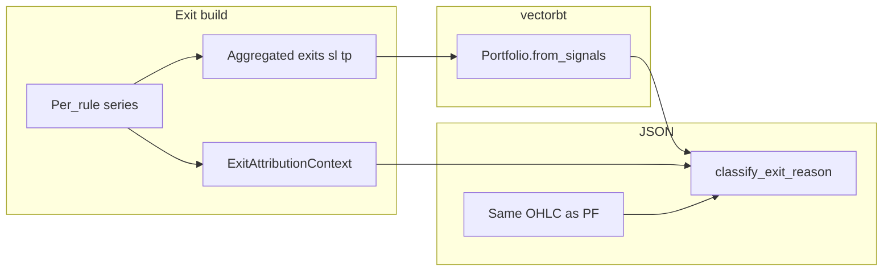

# Step 16 — exit_reason Attribution (Research JSON)

Связанный мастер-план: [`strategy_constructor_master_plan.md`](strategy_constructor_master_plan.md) (Step 16).  
Предшествующий шаг: [`15_ohlc_aware_vectorbt_plan.md`](15_ohlc_aware_vectorbt_plan.md) (Step 15 — тот же OHLC для портфеля и для атрибуции стопов).  
Базовый артефакт сделок: [`09_json_run_report.md`](09_json_run_report.md).

---

## 1. Как сделано сейчас (пайплайн)

Упрощённо поток такой:

```text
YAML config
  ↓
StrategySpec (ema_pullback)
  ↓
features / EMA / RSI / ATR / distances (план фич + колонки в DataFrame)
  ↓
entries / short_entries  (signals)
  ↓
exits + short_exits + sl_stop + tp_stop + output_counters  (exit layer)
  ↓
vectorbt Portfolio.from_signals(close, …, open, high, low, sl_stop, tp_stop)
  ↓
pf.trades.records
  ↓
trade_records в JSON  (extract_trade_records)
```

Якоря в коде:

- [`research/strategies/ema_pullback/execution/exits.py`](../../research/strategies/ema_pullback/execution/exits.py) — `build_exit_outputs_from_spec`, `compose_exit_signals`, агрегация distance в `sl_stop` / `tp_stop`.
- [`research/strategies/ema_pullback/execution/backtest.py`](../../research/strategies/ema_pullback/execution/backtest.py) — подготовка OHLC, вызов `Portfolio.from_signals`, затем `extract_trade_records`.
- [`research/strategies/ema_pullback/execution/results.py`](../../research/strategies/ema_pullback/execution/results.py) — `extract_trade_records`: нормализация сделок в JSON-поля.

После Step 15 портфель считается согласованно с тенями свечей: в `from_signals` передаются `open`, `high`, `low`, поэтому стопы и тейки могут сработать по экстремумам бара, а не только по `close`.

---

## 2. Где проблема

Проблема **не** в том, что vectorbt «неправильно» торгует: торговля уже соответствует переданным рядам и стопам.

Проблема в том, что **перед** запуском vectorbt мы **сжимаем** несколько exit-правил в четыре агрегированных ряда:

- несколько distance **stop_loss** → один `sl_stop` (в коде: по-баровый минимум distance, затем отношение к `close`);
- несколько **take_profit** → один `tp_stop`;
- несколько boolean **signal** exit → один `exits` / `short_exits` через логическое ИЛИ (`compose_exit_signals`).

В YAML/spec могут быть отдельные правила с разными `instance_id` (например, ATR SL, fixed SL, ATR TP, RSI exit). После сжатия портфель закрывает сделку корректно, но в `pf.trades.records` **нет** поля «какое именно правило сработало».

Сейчас `extract_trade_records` для каждой сделки выставляет плейсхолдер `"exit_reason": "unknown"` — в том числе для **открытых** сделок (выхода ещё нет, но строка всё равно `unknown`). Это не `null`: текущая реализация всегда пишет строку.

Параллельно в payload уже есть **агрегированные** counters по exit-компонентам, но по ним нельзя ответить: **эта конкретная сделка** закрылась по какому правилу.

---

## 3. Цель Step 16 (одно предложение)

Сейчас backtest знает, **где** сделка вышла, но JSON не знает **почему**. Step 16 добавляет слой объяснения: сохранить контекст exit-правил **до** сжатия и после `Portfolio.from_signals` подписать каждую сделку осмысленным `exit_reason` (SL / TP / signal и **какой** `instance_id`), **без** изменения семантики входов/выходов.

**Критерий готовности:** по закрытым сделкам в `trade_records` видно отличие `stop_loss` / `take_profit` / `signal` и при multi-instance — какой `instance_id`; классификация согласована с порядком исполнения vectorbt (приоритет стопов, затем SL перед TP на одном баре).

---

## 4. `ExitAttributionContext` (контракт)

Перед тем как правила сжимаются в агрегаты, exit-слой строит **шпаргалку** — объект `ExitAttributionContext` (имя рабочее; может жить рядом с `PortfolioExitOutputs`).

Минимально в контексте нужно:

1. **Порядок правил** — тот же, что в `spec.components.exits` (индекс в списке = tie-break при равенстве).
2. **По каждому правилу из spec:** `instance_id`, `component_id`, `exit_kind` (`stop_loss` | `take_profit` | `signal`).
3. **Signal exits:** per-rule boolean-серии отдельно для long и для short (**до** OR в общий `exits` / `short_exits`), чтобы на `exit_idx` можно было проверить «какое правило было True».
4. **Distance exits:** per-rule серии абсолютных уровней или долей от цены — **до** `min(axis=1)` по группе `stop_loss` / `take_profit`, плюс (опционально) ссылки на уже посчитанные агрегаты `sl_stop` / `tp_stop` для проверки согласованности с тем, что ушло в vectorbt.
5. **Сторона:** для signal-веток уже разделение long/short; для стопов классификация использует направление сделки из записи трейда.

**Якорь distance-стопов (`stop_entry_price`):** абсолютные уровни SL/TP для классификации нужно считать от **того же якоря, что использует vectorbt** для данного вызова `Portfolio.from_signals`. По умолчанию в vectorbt это **`stop_entry_price` = `close` на баре `entry_idx`** (тот же ряд `close`, что передан в портфель). Поле **`entry_price`** в `pf.trades.records` — цена исполнения входа; оно **не** заменяет якорь для расчёта стоп-уровней, если движок считает их от `close` (иначе при slippage или иной модели исполнения атрибуция разъедется с фактом портфеля). Если в backtest передают нестандартный `stop_entry_price` (ряд или скаляр), атрибуция обязана использовать **то же** правило; иначе — `unknown` или явное расширение контракта.

Поток данных:

- `build_exit_outputs_from_spec` (или расширенный `PortfolioExitOutputs`) возвращает вместе с `exits`, `short_exits`, `sl_stop`, `tp_stop`, `output_counters` ещё и `attribution_context`.
- [`backtest.py`](../../research/strategies/ema_pullback/execution/backtest.py) передаёт в `extract_trade_records` портфель, **тот же** `close` и **те же** `open` / `high` / `low`, что использовались в `from_signals`, плюс `attribution_context`.
- [`results.py`](../../research/strategies/ema_pullback/execution/results.py): `extract_trade_records(pf, close, *, open=..., high=..., low=..., attribution=None)`; при `attribution is None` — обратная совместимость: как сейчас, везде `"unknown"` (или явно задокументированное поведение для тестов).



---

## 5. Источник истины: порядок vectorbt

В `vectorbt` при `from_signals` со стопами: если на баре сработал стоп, обрабатывается **стоп**; пользовательская логика выхода по «обычному» сигналу для этого бара **не конкурирует** со стопом (документация: приоритет стоп-сигнала).

Внутри обработки бара для long в типичной ветке сначала проверяется **stop loss** (цена уходит вниз через уровень), затем при отсутствии срабатывания SL — **take profit**. Это задаёт порядок **SL перед TP** на одном баре.

**Классификация Step 16 обязана повторять этот порядок**, иначе JSON будет расходиться с фактом портфеля.

Практически: опираться на `vectorbt.portfolio.nb` (например, `get_stop_price_nb`) или эквивалент с идентичными ветвлениями long/short.

**Приоритет отчёта относительно signal exit:** если на одном `exit_idx` одновременно «объясним» и стоп (по OHLC), и True у boolean signal exit, в JSON побеждает **стоп** (например `stop_loss:atr_sl_1`, а не `signal:rsi_exit_1`), потому что так ведёт себя портфель.

---

## 6. OHLC и симуляция

Передача `open` / `high` / `low` в `Portfolio.from_signals` зафиксирована в Step 15 ([`15_ohlc_aware_vectorbt_plan.md`](15_ohlc_aware_vectorbt_plan.md)).

Атрибуция стопов/тейков обязана использовать **те же** OHLC-ряды (и тот же индекс), что и вызов портфеля, иначе подпись расходится с реальной сделкой. Для якоря distance-стопов по умолчанию нужен **тот же** ряд `close`, что в `from_signals` (см. §4 и §7.1).

---

## 7. Упрощающее допущение (MVP) и алгоритм классификации

### 7.1 Стопы на баре входа и якорь цены

При дефолтных `adjust_sl_func_nb` / `adjust_tp_func_nb` и без trailing значения `sl_stop` / `tp_stop`, которые фиксирует симулятор для позиции, в MVP берём с серий **`sl_stop` / `tp_stop` на баре `entry_idx`** сделки (см. `pf.trades.records`), а не replay по всем барам удержания.

**Цена сделки ≠ якорь для стопов.** В записи трейда `entry_price` — фактическая цена входа. В vectorbt при настройках по умолчанию distance-стопы привязаны к **`stop_entry_price`**, который совпадает с **`close` на баре `entry_idx`** (не к `entry_price`). Step 16 при вычислении уровней SL/TP для атрибуции должен использовать **`stop_anchor` = тот же stop anchor, что в симуляторе**; в **текущем** режиме backtest без переопределения `stop_entry_price` это **`close.iloc[entry_idx]`** (согласованный с вызовом портфеля `close`). Не подставлять `entry_price` вместо `stop_anchor`, если только код явно не перевёл портфель на другой якорь и атрибуция не воспроизводит его.

Если позже появятся trailing или кастомные adjust — либо расширяем контракт (replay), либо явно возвращаем `unknown` (и при необходимости отдельный флаг режима в будущем). См. non-goals ниже.

### 7.2 Проверка на баре выхода (long / short)

Использовать **high** / **low** бара `exit_idx` (те же ряды, что в портфеле).

Обозначение: **`stop_anchor`** — цена, от которой vectorbt умножает доли `sl_stop` / `tp_stop` в абсолютные уровни; **в текущем режиме** `stop_anchor = close[entry_idx]` (см. §7.1). Доли брать с **`entry_idx`** из тех же серий, что ушли в портфель.

Для **long**:

- из **`stop_anchor`** и доли SL с бара входа получить уровень стопа (ниже якоря для long);
- из **`stop_anchor`** и доли TP — уровень тейка (выше якоря);
- на `exit_idx`: если `low` пробил уровень SL → классификация как stop loss; иначе если `high` достиг уровня TP → take profit.

Для **short** (зеркально):

- stop loss: уровень выше якоря, срабатывание если `high` достиг уровня;
- take profit: уровень ниже якоря, срабатывание если `low` достиг уровня.

Конкретная формула уровня из доли `sl_stop`/`tp_stop` и из **`stop_anchor`** должна совпадать с той, что использует vectorbt для данного режима `stop_entry_price` (не выдумывать параллельную математику).

### 7.3 Порядок решения на одном баре

1. Если объясним **stop loss** по правилам выше → `stop_loss:<instance_id>` (выбор `instance_id`: §8 и §7.4).
2. Иначе если объясним **take profit** → `take_profit:<instance_id>`.
3. Иначе если на `exit_idx` у соответствующей стороны есть per-rule signal True → `signal:<instance_id>` с tie-break: **первое** правило в порядке `spec.components.exits`, для которого серия True (политика отчёта для OR-склейки; внутренний порядок vectorbt по «какому из OR» мог отличаться).
4. Иначе → `unknown`.

### 7.4 Привязка `instance_id` при агрегате `min` для distance

В [`execution/exits.py`](../../research/strategies/ema_pullback/execution/exits.py) для нескольких правил `stop_loss` (аналогично `take_profit`) строится по-баровый минимум distance, затем отношение к `close` — **тот же** агрегат, что в `Portfolio.from_signals`.

Чтобы подписать сделку:

1. На `entry_idx` взять per-rule вклад (серии **до** объединения `min(axis=1)`), в группе `stop_loss` или `take_profit`.
2. Сравнить с агрегированным значением на том же баре (при необходимости допуск по float).
3. Среди совпавших выбрать правило с **минимальным индексом** в `spec.components.exits`.

---

## 8. Контракт поля `exit_reason`

Строка в нижнем регистре, без пробелов, одно поле (до отдельных полей `exit_kind` / `exit_instance_id` в будущем).

### 8.1 Закрытые сделки

```text
stop_loss:<instance_id>
take_profit:<instance_id>
signal:<instance_id>
unknown
```

Примеры: `stop_loss:atr_stop_1`, `take_profit:atr_tp_1`, `signal:rsi_exit_1`.

- **`stop_loss:` / `take_profit:`** — выход атрибутирован как срабатывание соответствующего агрегированного стопа; `instance_id` — правило из `components.exits`, выбранное по §7.4 (и согласованное с приоритетом SL перед TP, §5).
- **`signal:`** — стопы на `exit_idx` не объясняют выход; на баре выхода у данной стороны True у per-rule signal exit (§7.3).
- **`unknown`** — нет `attribution_context`, неподдерживаемый режим стопов, или внутренняя неконсистентность (закрытие без объяснения стопами и без True в per-rule signal на `exit_idx`).

**Миграция с черновика плана:** ранее обсуждались префиксы `sl:` / `tp:` и `null` для открытых. Единый стандарт Step 16 — префиксы `stop_loss:` / `take_profit:` / `signal:` и строка `open` для открытых (не `null`), чтобы не плодить два формата.

### 8.2 Открытые сделки

```text
exit_reason = "open"
```

Выхода ещё не было; `exit_time_ms` / `exit_price` по-прежнему `null` в JSON, если так задано нормализатором.

### 8.3 Версия отчёта

Расширение допустимых значений строки `exit_reason` при том же наборе полей схемы обычно не требует bump `report_schema_version`. Если позже добавятся отдельные поля (`exit_kind`, `exit_instance_id`), имеет смысл поднять версию и обновить [`09_json_run_report.md`](09_json_run_report.md).

---

## 9. Scope (in)

- Family `ema_pullback`: путь `build_exit_outputs_from_spec` → `Portfolio.from_signals` → `extract_trade_records`.
- Построение `ExitAttributionContext` и заполнение `exit_reason` при переданном контексте (серии per-rule, OHLC, порядок правил в spec).
- Юнит-тесты под `optional_vectorbt`: синтетика SL-only, TP-only, signal-only, **стоп vs signal на одном баре** (побеждает стоп), long/short, открытая сделка → `"open"`.
- Краткое обновление [`09_json_run_report.md`](09_json_run_report.md): допустимые значения `exit_reason` и политика приоритетов (ссылка на этот документ).

## 10. Non-goals (out)

- Менять семантику входов/выходов стратегии (только отчётность / классификация уже смоделированного).
- Глобальный framework для всех family до появления второго consumer.
- База результатов, API, frontend.
- Гарантировать атрибуцию при произвольных `adjust_sl_func_nb` / `adjust_tp_func_nb` / trailing без явного расширения плана (см. §7.1).

---

## 11. Архитектура кода (предложение)

| Компонент | Назначение |
|-----------|------------|
| Новый модуль, напр. `execution/exit_attribution.py` | Чистые функции: тип/сборка `ExitAttributionContext`, `classify_exit_reason` для одной записи trade; при необходимости обёртки над vectorbt nb. |
| `execution/exits.py` | Помимо агрегатов — построение `ExitAttributionContext`: per-rule boolean (long/short), per-rule distance до `min`, порядок из `spec.components.exits`. Переиспользовать уже разрешённые `(fn, rule)` из `build_exit_outputs_from_spec`. |
| `execution/results.py` | `extract_trade_records(..., attribution=None)`; при контексте — выставлять `exit_reason` по §8; без контекста — совместимость. |
| `execution/backtest.py` | Пробросить OHLC и `attribution_context` в extract (см. [`15_ohlc_aware_vectorbt_plan.md`](15_ohlc_aware_vectorbt_plan.md)). |

---

## 12. Тестирование

- Существующие тесты без vectorbt / без контекста не должны ломаться.
- Под `@pytest.mark.optional_vectorbt`: синтетические `close` и явные `high`/`low` там, где нужна атрибуция по теням; ожидаемые префиксы `stop_loss:` / `take_profit:` / `signal:`.
- Регрессия: открытая сделка → `exit_reason == "open"` (после внедрения; до внедрения тесты могут ожидать текущий плейсхолдер — обновить в том же PR, что и реализация).

---

## 13. Acceptance

- `pytest` (включая optional marker при наличии vectorbt) зелёный.
- Прогон family runner / smoke по желанию команды; `data_engine/` не меняется.
- В `trade_records` закрытых сделок при типичном конфиге с SL/TP/signal доминируют не `unknown`, а осмысленные строки §8.

---

## 14. Связанные файлы

- [`research/strategies/ema_pullback/execution/results.py`](../../research/strategies/ema_pullback/execution/results.py) — `extract_trade_records`.
- [`research/strategies/ema_pullback/execution/exits.py`](../../research/strategies/ema_pullback/execution/exits.py) — `build_exit_outputs_from_spec`, `compose_exit_signals`, агрегация distance.
- [`research/strategies/ema_pullback/execution/backtest.py`](../../research/strategies/ema_pullback/execution/backtest.py) — `Portfolio.from_signals`, вызов extract.
