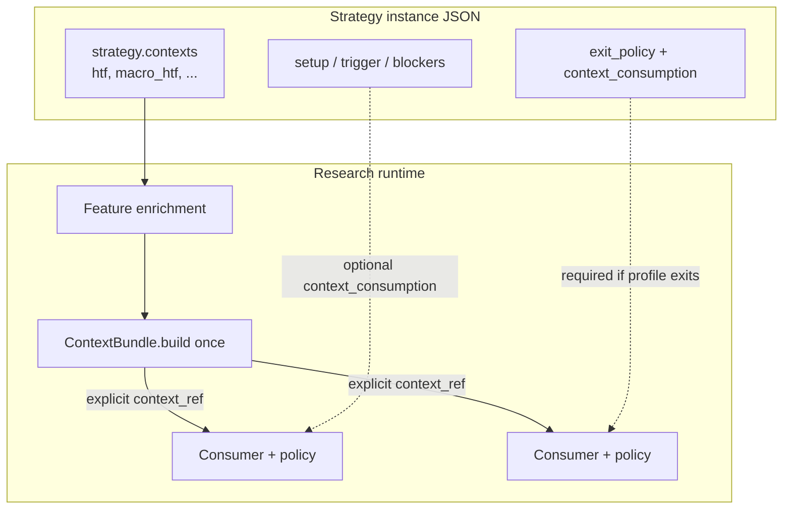

# Strategy-level contexts and context consumption — design

## 1. Problem

HTF EMA stack context is modeled today as **`trade_management.exit_policy.context`** — a provider config owned by exit policy. Exit policy uses that context to choose among `aligned` / `countertrend` / `neutral` profile buckets. Consequences:

- Context cannot be shared cleanly by setup, triggers, or blockers without duplicating config or inventing `htf_gated_*` component_ids.
- Provider responsibilities are mixed with consumer responsibilities.
- Prior spikes introduced implicit fallbacks and nested provider config — rolled back; **not** an implementation source.

We need a **single strategy-level provider registry** and **optional explicit consumption** per component instance, with one target JSON shape and no runtime legacy paths.

## 2. Current baseline

After rollback (post-spike):

| Area | State |
|------|--------|
| **Instance JSON** | `trade_management.exit_policy.context` with `htf_context` provider fields |
| **Spec types** | `HtfContextConfigSpec` nested under `ExitPolicySpec` |
| **Features / runtime / catalog / Composer** | HTF sourced from exit policy context |
| **`strategy.contexts` / `context_consumption`** | Absent |

**Historical artifacts**: Reports with `report_schema_version` 3/4 remain on disk. **Old strategy config shape is not supported** by the new implementation; reading an old report does not imply Composer or validate API accept `exit_policy.context`.

## 3. Target architecture



**Invariants**

1. **Provider** only under `strategy.contexts[<context_ref>]`.
2. **Provider** outputs state/readiness/features — no trading decisions.
3. **Consumer** uses `context_consumption.context_ref` + consumer-owned `policy`.
4. **Entry components** without `context_consumption` → do not read bundle.
5. **Exit policy** with non-empty profile-scoped exits → `context_consumption` **required** (validation error if missing).
6. **Exit policy** with only `always_on` exits → `context_consumption` omitted; valid.
7. **No implicit `context_ref`** anywhere (runtime, validation, UI, chart).

## 4. Responsibility boundaries

| Concern | Owner | Must not |
|---------|--------|----------|
| Provider config | `strategy.contexts` | Live under exit_policy |
| Provider execution | Context provider components | Know consumers or policies |
| Consumer context selection | `context_consumption.context_ref` | Default to first/only context |
| Consumer interpretation | `context_consumption.policy` | Live on provider or in browser-only rules |
| Profile bucket activation | Exit consumer policy | Activate profile exits without `context_consumption` when profiles non-empty |
| Catalog / validate | research_api + research loader | Diverge; accept `exit_policy.context` |
| HTF/EMA computation | Research feature pipeline | Run in frontend or data_engine |

## 5. Data model / instance shape

### 5.1 Strategy-level providers (multi-context)

```yaml
strategy:
  contexts:
    htf:
      component_id: htf_context
      timeframe: 4h
      source: close
      fast_period: 100
      anchor_period: 200
      slow_period: 1000
    macro_htf:
      component_id: htf_context
      timeframe: 1d
      # ...
```

- `contexts` is a map; keys are author-chosen `context_ref` strings and are **case-sensitive** (`HTF` and `htf` are different refs) and used as-is.
- Root spec always contains `contexts` with default `{}`.
- Non-empty `contexts` is required only when at least one `context_consumption` references a context or a feature/provider explicitly requires context inputs.
- Multiple HTF stacks are allowed; consumers pick which ref to use.

### 5.2 Optional consumer block

```yaml
context_consumption:
  context_ref: htf
  policy:
    policy_id: exit_profile_by_htf_state
    params: {}
```

- Omitted on entry components → no bundle access.
- On exit policy → **required** when any of `profiles.aligned|countertrend|neutral` has non-empty `exits`.

### 5.3 Exit policy (target)

```yaml
trade_management:
  exit_policy:
    context_consumption:
      context_ref: htf
      policy:
        policy_id: exit_profile_by_htf_state
        params: {}
    always_on: { exits: [...] }
    profiles:
      aligned: { exits: [...] }
      countertrend: { exits: [...] }
      neutral: { exits: [...] }
```

**Forbidden**: `trade_management.exit_policy.context`.

### 5.4 Validation rules

| Rule | Behavior |
|------|----------|
| `exit_policy.context` present | Validation **error** (no runtime read) |
| Profile exits non-empty, no `context_consumption` | Validation **error** |
| Only `always_on` exits, no `context_consumption` | Valid |
| Consumer `context_ref` | MUST exist in `strategy.contexts` |
| No fallback | Never default to first context key |
| Multi-consumer | Exit may use `htf`; blocker may use `macro_htf` — each explicit |

### 5.5 Typed models

- `StrategyContextsSpec`, `ContextProviderSpec`, `ContextConsumptionSpec`
- `ExitPolicySpec`: optional `context_consumption`; **no** `context: HtfContextConfigSpec`
- Family root: `contexts: StrategyContextsSpec = {}`

## 6. Runtime data flow

1. Load instance → validate (target shape only).
2. Feature plan registers columns from **`strategy.contexts`** only.
3. Enrich OHLCV.
4. **`ContextBundle.build`** once → outputs per `context_ref`.
5. Consumers with `context_consumption` call `bundle.get(context_ref)` and apply policy.
6. Exit compiler: policy selects profile bucket; compile exits.
7. Execution receives final masks/signals only.

**Equivalence proof (Phase 1)**: Golden tests compare **new JSON** (`strategy.contexts` + `exit_policy.context_consumption`) against **pre-change baseline behavior** (same trades, profile locks). Fixtures are migrated to target shape offline — not via loader dual-read.

## 7. Exit policy migration

| Today | Target |
|-------|--------|
| `exit_policy.context` = provider | `strategy.contexts.<ref>` = provider |
| Compiler reads nested context | `exit_policy.context_consumption` + policy |
| Profile names in JSON | Unchanged rule groups; selection = consumer policy |

**No runtime migration**: Authors and default templates ship in target shape. Legacy stored configs: **one-off migration script** (optional, not invoked by loader) or manual edit.

**Profile exits rule**: Non-empty `profiles.*.exits` without `context_consumption` → validation error (prevents silent “profiles never activate”).

## 8. Entry component context consumption

- **Phase 3**: One reference consumer (setup **or** blocker) with existing `component_id` — no `htf_gated_*`.
- Example: blocker keeps its original `component_id`; adds `context_consumption` with entry policy (e.g. `htf_state_gate`).
- Mass enablement for all components: out of scope for this change.

## 9. Research API / catalog / validation

- Catalog: `strategy_contexts` section; remove `exit_policy_context` provider section.
- Per `(role, component_id)`: `supports_context_consumption`, allowed `policy_id`, `params_schema`.
- Validate endpoint shares research loader logic.
- Reject `exit_policy.context` in API validate same as loader.

## 10. Frontend Composer UX

### Strategy contexts

- Add/edit/remove `context_ref` providers (HTF fields only here).

### Exit policy

- No provider fields.
- `context_consumption` required in UI when profile exit groups are non-empty (mirror validation).
- Explicit `context_ref` pick list from defined contexts — no auto-select.

### Entry forms (Phase 2 catalog/UI on already-enabled catalog ids; Phase 3 reference consumer)

- Phase 2 renders entry `context_consumption` only for component_ids already marked in catalog as supporting it.
- Before Phase 3, this may mean only exit policy exposes visible consumption controls.
- Same consumption pattern applies once additional entry component_ids are enabled.

### Chart HTF overlay

Overlay provider config MUST come from an **explicit** source — one of:

1. **Selected consumer** — e.g. when inspecting a trade/bar, show HTF periods for the `context_ref` used by the relevant consumer (exit vs entry attribution from trace).
2. **Chart display config** — dedicated `chart.context_overlay_ref` (or equivalent) set by the user in Chart UI.
3. **Explicit picker** in Chart settings listing `strategy.contexts` keys.

**Forbidden**: defaulting to “first HTF provider”, “only context”, or any ordered fallback. Display convenience MUST NOT affect execution or validation.

## 11. Chart / reports / diagnostics

### Trace (Phase 4)

`context_consumption_trace`: `role`, `component_id`, `context_ref`, `policy_id`, `context_applied`, outcomes.

### Trade records (schema v5, Phase 4)

- `entry_context_consumption` / `exit_context_consumption` separate.
- `entry_context_state` unchanged semantics for analytics.

### Historical reports

- **v3/v4**: Continue to load as read-only historical artifacts.
- **Old `exit_policy.context` in strategy_spec inside old runs**: Display MAY show embedded legacy meta for forensics; Composer MUST NOT offer editing that shape for new drafts.

## 12. Migration phases

| Phase | Scope | Deliverable |
|-------|--------|-------------|
| **1** | research | `strategy.contexts`, `ContextBundle`, `exit_policy.context_consumption`, reject `exit_policy.context`, profile-exits validation, default templates in target shape, equivalence tests (migrated JSON vs baseline) |
| **2** | research_api + frontend | Catalog, validate, Composer strategy contexts + exit consumption (no legacy provider form) |
| **3** | research + catalog | Reference entry `context_consumption` (one component_id) |
| **4** | trace + reports + chart | `context_consumption_trace`, schema v5 fields, chart explicit overlay ref, inspector attribution |

No Phase for runtime dual-read or loader shim.

## 13. Acceptance criteria

- [ ] `exit_policy.context` rejected by loader and API.
- [ ] Profile exits + no `context_consumption` → validation error.
- [ ] `always_on`-only exit policy without consumption → valid.
- [ ] Equivalence: target-shape JSON matches baseline trades/profile locks.
- [ ] Unknown `context_ref` → validation error; no first-context fallback.
- [ ] Multi-context: two consumers can use different `context_ref` values.
- [ ] Chart overlay uses explicit ref only.
- [ ] v3/v4 reports load; Composer does not author `exit_policy.context`.
- [ ] Loading a historical report that embeds `exit_policy.context` does not populate a Composer draft in the old shape.
- [ ] No HTF/EMA in browser; no `htf_gated_*`; no data_engine changes.

## 14. Test plan

| Layer | Tests |
|-------|--------|
| research | Reject `exit_policy.context`; profile+no consumption error; always_on-only valid; bundle multi-ref; equivalence vs baseline with migrated fixtures |
| research_api | Validate parity; catalog sections |
| frontend | No auto-select; strip disabled consumption; chart overlay requires explicit ref |
| integration | Phase 4 trace `context_applied`; entry vs exit attribution |

## 15. Explicit non-goals

- `data_engine/` changes.
- Runtime dual-read, loader shim, normalize-on-load.
- `htf_gated_*` component_ids.
- Generic rule engine; frontend-only condition builder.
- Browser HTF/EMA computation.
- Mass entry-component migration in one phase.
- Composer editing `exit_policy.context`.
- “First context” default in UI or chart.

## 16. Rollback / safety notes

- **Rollback** = revert git deploy; no feature flag for legacy JSON in loader.
- **Stored configs**: Use optional **one-off migration script** (CLI, not runtime) to rewrite `exit_policy.context` → `strategy.contexts` + `exit_policy.context_consumption`; keep script out of hot path.
- **Reports**: Additive v5 only; never rewrite historical report files on disk.
- If Phase 1 equivalence fails, do not merge Phase 2 Composer until policy mapping is fixed.

## 17. Follow-up changes

- **[`trade-context-causal-diagnostics-v1`](../trade-context-causal-diagnostics-v1/)** — wiring vs causal diagnostics: honest `applied` on trade rows, Chart trade panel **Entry/Exit bar decision** from `signal_trace` (Bar Inspector stays per-click bar). Phase 4 v5 fields remain provenance; gate allow/block lives in trace.

## Open questions

1. Exact `policy_id` and params for first entry reference consumer (setup vs blocker).
2. Chart UI: dedicated `chart.context_overlay_ref` vs consumer-attributed overlay only (both satisfy explicit-selection rule).
