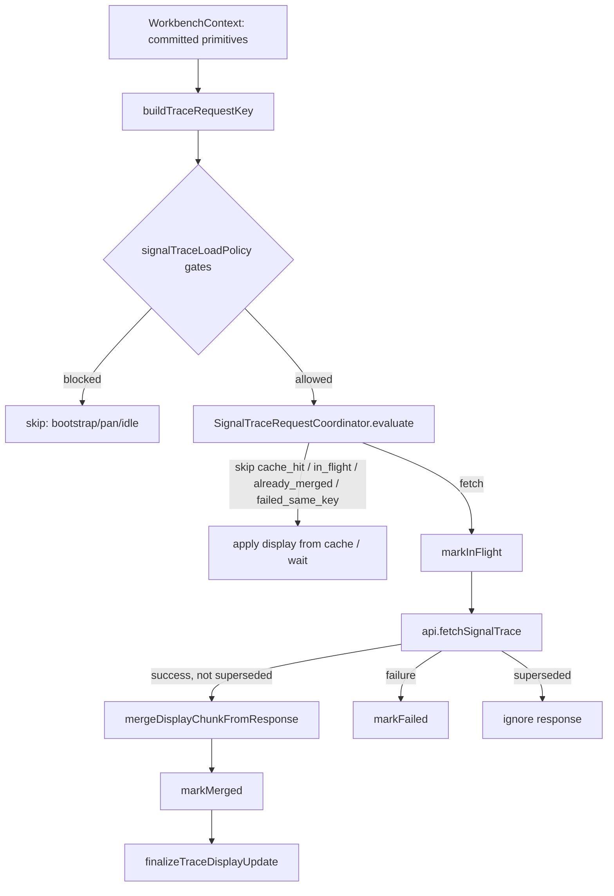

## Context

### Observed failure

One backtest → **362** identical:

```http
GET /api/research/runs/{run_id}/signal-trace?variant=...&from=1762611900000&to_open_time_ms=1777611600000
```

Pipeline debug (same session): `api.fetchSignalTrace` ×362, `wb.signal_trace_decision` ×362, `wb.signal_trace.fetch_start` ×362, `wb.trace_display.cache_miss` ×362, `wb.trace_display.merge_chunk` ×362. Market bundle and report: **1** request each.

### Root cause (frontend)

Current loop in `WorkbenchContext` signal-trace `useEffect` (`~1467–1709`):

1. `decideSignalTraceLoad` authorizes fetch when `!displayCacheCoversWindow` (policy treats display coverage as network gate).
2. Fetch completes → `mergeDisplayChunkFromResponse` → `setDisplayCacheVersion(+1)`.
3. Effect deps include `displayCacheVersion` and `displayCacheCoversWindow` (derived from `coversRange`).
4. After merge, `coversRange(fullWindow)` may still be **false** (BFF truncation: chunk covers returned sub-span only — correct per spec).
5. `inFlightTraceRequestRef` cleared in `finally`; `skip_identical_in_flight` no longer applies.
6. Policy returns `load_start` again for the **same** fetch params → storm.

**Hybrid responsibility leak:** policy + refs + display cache revision jointly decide network fetch; none owns “this BFF resource was already fetched.”

### Architectural boundary (must hold)

| Layer | Identity | Responsibility |
|-------|----------|----------------|
| **Network trace** | `traceRequestKey` = exact normalized BFF fetch params | At most one in-flight GET per key per session; no refetch after `markMerged(K)` until reset |
| **Display / strategy instance** | `selectedStrategyInstanceId`, marker filters | Filter/slice/present after cache merge; never in `traceRequestKey` unless BFF query param |

Workbench may have **2+ strategy instances** sharing one trace response; switching instance must re-filter display, not refetch the same URL.

## Goals / Non-Goals

**Goals:**

- ≤1 `api.fetchSignalTrace` per distinct `traceRequestKey` per coordinator session (until explicit reset).
- After successful merge for `K`, subsequent effect runs with same fetch params → `already_merged` / `cache_hit` / `in_flight`, never `fetch`.
- Multi-instance: instance switch with unchanged fetch params → no network.
- Pan K1 → K2 → K1: `mergedKeys` retains K1 → no refetch when returning (display may slice from cache).
- Strict ownership table; no hybrid dedupe.
- Primitive-only effect deps; coverage read via `signalTraceDisplayCacheRef.current.coversRange(...)` inside effect.
- Debug proves coordinator decisions.

**Non-Goals:**

- Fix BFF truncation or raise `MAX_SIGNAL_TRACE_BARS`
- Multi-chunk incremental fetch for uncovered tail
- ChartPanel, viewport, market bundle, backtest performance
- `api/client.ts` changes beyond calling existing `fetchSignalTrace`
- Debounce / `lastUrlRef` / loading-status dedupe

## Ownership boundaries

| Module | Owns | Must NOT |
|--------|------|----------|
| **`api/client.ts`** | `fetchSignalTrace(params)` HTTP GET | dedupe, cache, window loaded state, instance filtering |
| **`SignalTraceRequestCoordinator`** | `traceRequestKey`; fetch authorization; `inFlightKeys`; `mergedKeys` (Set or bounded LRU); `failedKeys`; superseded/stale; `evaluate()` → decision | merge trace data; React state; markers; ChartPanel; BFF internals; selected UI instance |
| **`SignalTraceDisplayCache`** | merge chunk; `coversRange`; slice events / HTF | decide refetch; treat `coversRange=false` as fetch authorization |
| **`traceDisplayOrchestrator`** | display / pan / coalescing / apply current window | durable network dedupe |
| **`signalTraceLoadPolicy`** | bootstrap / session / idle / pan gates only | `cache_hit`, `in_flight`, `already_merged`, `superseded`, durable fetch authorization |
| **`WorkbenchContext`** | committed primitives; build key; policy gates → coordinator → `fetchSignalTrace` on `fetch` only; merge on success; `markMerged` / `markFailed` / `clearInFlight` | `lastUrlRef`, debounce, status-loading dedupe, object in-flight guard, local already-fetched guard, per-instance network dedupe |
| **`ChartPanel`** | chart rendering | signal-trace fetch orchestration |
| **BFF / research_api / backtest** | trace payload | (unchanged) |

## Target pipeline



### Steps

1. **Committed inputs** (primitives): `runId`, `variantKey`, `committedFromMs`, `committedToOpenTimeMs`, `effectiveContextOverlayRef`.
2. **`buildTraceRequestKey(normalizedFetchParams)`** — must match actual URL query set.
3. **Policy gates** (`evaluateSignalTraceBootstrap`, `planTraceDisplayLoad` pan/bootstrap/session/idle only).
4. **`coordinator.evaluate({ key, generation, displayCacheCovers? })`** — display coverage may inform `cache_hit` for **skip display work**, but **`already_merged` / `mergedKeys` is authoritative for network** even when `coversRange === false`.
5. On **`fetch`**: `markInFlight` → await `fetchSignalTrace` → if generation/key not superseded: merge → `markMerged` → `clearInFlight`.
6. On **failure**: `markFailed(K)` — no retry loop from effect re-run until key changes or `reset()`.
7. **Session restore**: `markMerged(K, "session_restore")` before/with merge; no bypass fetch.

### `traceRequestKey`

Canonical string from normalized params passed to `fetchSignalTrace`:

- `run_id`
- `variant`
- `committed_from_ms` (first candle open, ms)
- `committed_to_open_time_ms` (last candle open, ms)
- `context_overlay_ref` (empty string if null)

**Excluded unless BFF adds query param:** `selectedStrategyInstanceId`, `chartWindowKey` (render-window label may differ in formatting but must not diverge from ms params), `displayCacheVersion`, lane state.

**Invariant:** key bytes must match the resource the BFF serves for those query params (no inclusive/exclusive mismatch between key builder and `evaluateSignalTraceBootstrap` / `fetchSignalTrace` call).

### `SignalTraceRequestCoordinator` API (sketch)

```ts
type TraceRequestKey = string;

type CoordinatorDecision =
  | { action: "fetch"; key: TraceRequestKey; generation: number }
  | { action: "skip"; reason: "cache_hit" | "in_flight" | "already_merged" | "failed_same_key" | "superseded" };

evaluate(input: {
  key: TraceRequestKey;
  generation: number;
  displayCacheCoversWindow: boolean; // optional hint for cache_hit only
}): CoordinatorDecision;

markInFlight(key, generation): void;
clearInFlight(key, generation): void;
markMerged(key, source: "network" | "session_restore"): void;
markFailed(key, error?: string): void;
reset(reason: "run" | "variant" | "context_overlay" | "session" | "reload"): void;
```

- **`mergedKeys`**: `Set<TraceRequestKey>` or bounded LRU — **not** single `lastMergedKey`.
- **`inFlightKeys`**: `Map<TraceRequestKey, generation>`.
- **`failedKeys`**: `Map<TraceRequestKey, { at: number }>` until reset.
- **Superseded**: if `generation !== coordinator.currentGeneration` or key replaced before response, drop response (no merge, no state).

**Lifecycle:** one instance per `WorkbenchProvider` / chart runtime session (`useRef(createCoordinator())`), shared across strategy instances.

### Policy vs coordinator (no hybrid)

| Decision | Owner |
|----------|--------|
| `no_report`, `market_not_ready`, pan idle defer, fetch superseded by coalesced intent | Policy / orchestrator |
| `cache_hit`, `in_flight`, `already_merged`, `failed_same_key`, authorize `fetch` | **Coordinator only** |
| `coversRange` for markers/HTF slice | Display cache + apply path |
| Instance marker filter | Display layer after slice |

**Remove from `decideSignalTraceLoad`:** `skip_display_cache_hit`, `skip_already_loading`, `skip_identical_in_flight`, `load_start` as network authorization. Keep `restore_session_cache` path as policy hint; coordinator still `markMerged` on restore.

### Effect dependencies (hard rule)

**Allowed:** `selectedRunId`, `selectedVariantKey`, `committedFromMs`, `committedToOpenTimeMs`, `effectiveContextOverlayRef`, `marketLoadStatus`, `renderWindowRevision` (only if committed bounds change).

**Forbidden:** `report`, `selectedVariant` object, `selectedStrategyInstanceId` (unless BFF param), `chartWindowSlice`, `chartViewModel`, `chartDisplayComponentEvents`, `chartDisplayAuxEmaOverlays`, `displayCacheVersion`, `displayCacheCoversWindow`, merge/apply output objects.

Read coverage inside effect:

```ts
const covers = signalTraceDisplayCacheRef.current.coversRange(fromSec, toSec);
```

### Reset policy

**`coordinator.reset()` on:** run/report identity change; variant identity change; context overlay ref change (fetch param); explicit full trace/session cache reset; user reload / backtest rerun identity reset.

**MUST NOT reset on:** ordinary committed render window pan K1→K2; `selectedStrategyInstanceId` change when fetch params unchanged; display filter / marker toggles; setup/exit/entry display selection.

### Failure policy

Failed fetch for `K` → `markFailed(K)` → `evaluate(K)` returns `failed_same_key` until `K` changes or `reset()`. Effect re-run alone must not retry.

### Multi-instance behavior

- Coordinator is **shared** at WorkbenchProvider level.
- Two instances requesting same `traceRequestKey` share `inFlightKeys` / `mergedKeys`.
- **Scenario:** instance_1 triggers fetch for K1; user switches to instance_2; URL params unchanged → `already_merged` or `cache_hit`; markers re-filter by `instance_id` at display layer.
- If `/signal-trace` response includes multiple `instance_id` values, filtering is **post-merge** only.

## Decisions

### D1: Coordinator owns network ledger; display cache owns coverage

**Why:** `coversRange=false` after truncation is **correct** and must not imply “fetch again same URL.”

**Alternative rejected:** Teach policy to skip when `loadingTraceWindowKey` matches — still breaks when `finally` clears ref and on `displayCacheVersion` loops.

### D2: `mergedKeys` survives pan window changes

**Why:** K1→K2→K1 must not refetch if response for K1 was already merged.

**Alternative rejected:** Reset coordinator on every `chartWindowKey` change — defeats pan-back dedupe.

### D3: Separate `traceRequestKey` from `chartWindowKey`

**Why:** `chartWindowKey` embeds sec bounds for display/session bundle; network key uses **ms** params identical to `fetchSignalTrace`. They may be derived from same candles but coordinator key must track **HTTP resource**.

### D4: `already_merged` wins over `cache_miss` display debug

**Why:** Debug may still log `cache_miss` for display slice while network skip is `already_merged` — operators need both fields in `wb.signal_trace_decision` meta.

### D5: Keep `traceLoadGenerationRef` for superseded async only

**Why:** Stale response ignore is not durable dedupe; pairs with coordinator generation per key.

## Risks / Trade-offs

| Risk | Mitigation |
|------|------------|
| Legitimate refetch after truncated response when user needs tail chunk | Out of scope (future multi-chunk task); this change stops **identical** URL storm only |
| `mergedKeys` Set grows unbounded | Bounded LRU optional; reset on run/variant/context |
| Key mismatch vs URL | Unit test: key from bootstrap params equals client URL builder |
| Session restore bypasses coordinator | `markMerged` in restore path; test |
| HTF regression | Manual + existing overlay tests in acceptance |

## Migration Plan

1. Land coordinator + tests (no Workbench wire).
2. Strip policy dedupe; migrate tests.
3. Wire Workbench effect; verify pipeline debug ≤1 per key.
4. Archive supersedes `signal-trace-fetch-dedup` draft (do not apply both).

**Rollback:** Revert frontend-only; no BFF migration.

## Open Questions

- **LRU size for `mergedKeys`:** default unbounded Set for v1, or cap at N keys (e.g. 32) with same reset rules?
- **`cache_hit` vs `already_merged`:** expose both when display covers but lanes need session bundle — coordinator skip reason should still block duplicate network for same K.
